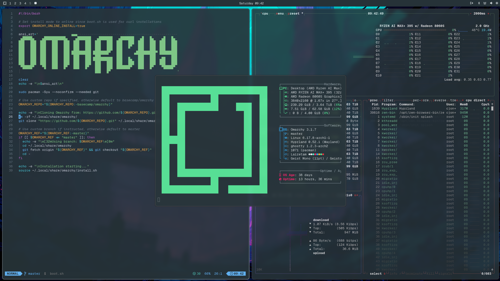

# Lairetam Theme for Omarchy

Inspired by Google's Material Design 2 color system and made for Omarchy - the opinionated Arch-based Linux distribution made for pioneers.

I created this theme because Material Design 2's color palette excels where it matters most: extended coding sessions, terminal work, and complex technical tasks. The colors are easy on the eyes while providing excellent syntax highlighting and visual hierarchy.

## Screenshot

<p align="center">
  
</p>

### Font
The font I'm using in the screenshot is called Geist Mono (https://vercel.com/font)

## Installation

### Omarchy

To install this theme, simply use the `omarchy-theme-install` command:

```bash
omarchy-theme-install https://github.com/chrisintheshell/omarchy-lairetam-theme
```

## Neovim Theme
See my `lairetam-neovim` repository for the Neovim theme.

